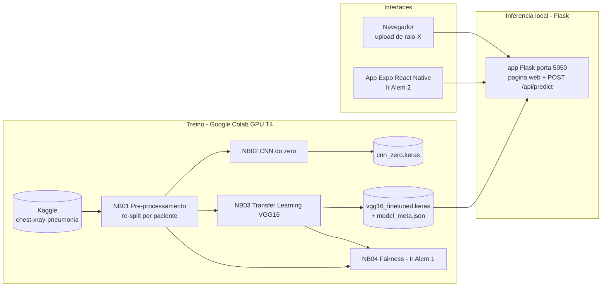

# Faculdade de Informatica e Administracao Paulista

<p align="center">
  
</p>

# CardioIA Visao Computacional - Assistente Cardiologico Virtual

**FIAP | Tecnologo em Inteligencia Artificial | Fase 4 | Capitulo 1**

## Grupo 72 

| Integrante | GitHub |
|---|---|
| Felipe Sabino da Silva | [@FelipeSabinoTMRS](https://github.com/FelipeSabinoTMRS) |
| Juan Felipe Voltolini | [@juanvoltolini-rm562890](https://github.com/juanvoltolini-rm562890) |
| Luiz Henrique Ribeiro de Oliveira | [@Luiz-FIAP](https://github.com/Luiz-FIAP) |
| Marco Aurelio Eberhardt Assumpcao | [@marcofiap](https://github.com/marcofiap) |
| Paulo Henrique Senise | [@PauloSenise](https://github.com/PauloSenise) |

## Descricao

Este repositorio implementa a fase **CardioIA Visao Computacional**, continuidade do projeto da Fase 3. Na etapa anterior, a CardioIA estruturou o monitoramento continuo de sinais vitais com IoT (ESP32, MQTT e dashboard Node-RED). Nesta fase, a solucao avanca para a analise de imagens medicas com **Deep Learning**: um prototipo que pre-processa radiografias de torax, treina e compara uma **CNN do zero** com **Transfer Learning (VGG16)** e apresenta a classificacao (NORMAL vs PNEUMONIA) em uma interface web Flask e em um app mobile.

O sistema cobre o fluxo completo de visao computacional aplicada a saude:

```text
dataset publico -> pre-processamento -> treino CNN / transfer learning -> avaliacao -> prototipo web e mobile
```

### Arquitetura da solução



O dataset escolhido foi o **Chest X-Ray Pneumonia** (Kaggle `paultimothymooney/chest-xray-pneumonia`), com 5.856 radiografias de torax pediatricas rotuladas como NORMAL ou PNEUMONIA (subtipos bacteria e virus). A escolha e justificada no relatorio da Parte 1.

Tambem serao implementados os desafios "Ir Alem":

- **Ir Alem 1**: analise de etica e fairness do dataset e do modelo (vies, desbalanceamento, subgrupos bacteria/virus).
- **Ir Alem 2**: app mobile em React Native (Expo) com upload de imagem, integrado ao backend Flask.

## Estrutura de pastas

```text
.
|-- assets/
|   |-- logo-fiap.png
|   `-- evidencias/
|       `-- README.md
|-- data/
|   |-- README.md
|   `-- splits/              # manifestos CSV do re-split (gerados pelo NB01)
|-- docs/
|   |-- plano_de_trabalho.md # divisao de tarefas entre os 5 integrantes
|   `-- relatorio_parte1_preprocessamento.md
|-- document/
|   `-- (documento mestre FIAP - Etapa 4)
|-- models/
|   `-- README.md            # como obter os modelos .keras (GitHub Release/Drive)
|-- notebooks/
|   |-- 01_preprocessamento.ipynb
|   `-- 03_transfer_learning.ipynb
|-- scripts/
|   `-- (download_model.py e test_api.sh - Etapas 2 e 3)
|-- src/
|   |-- flask-app/           # prototipo web + API REST (Etapa 2)
|   `-- mobile/              # app Expo React Native (Etapa 2)
`-- README.md
```

As pastas marcadas com "Etapa N" serao preenchidas conforme a divisao de trabalho em `docs/plano_de_trabalho.md`.

## Como Executar o Projeto Localmente

Como os arquivos de pesos das redes neurais (`.keras` e `.h5`) são muito grandes para o histórico do Git, estruturamos um script automatizado que busca esses artefatos diretamente dos Releases do repositório.

### 1. Pré-requisitos e Sincronização dos Modelos
Antes de iniciar a API Flask ou os ambientes de testes, garanta que todas as dependências estejam instaladas e execute o script de sincronização para baixar os modelos de IA:

```bash
# Instalar as dependências do projeto
pip install -r requirements.txt

# Baixar os modelos treinados (VGG16 e CNN do Zero) e metadados
python scripts/download_model.py
```

### 2. Executando o Servidor (Flask)
Após o término do download, os arquivos estarão posicionados na pasta models/. Para iniciar o servidor de inferência:
`python src/flask-app/app.py`

## Desenvolvimento e Avaliação dos Modelos

### Treinamento da Rede VGG16 (Transfer Learning)

O modelo contido em `notebooks/03_transfer_learning.ipynb` utiliza a arquitetura consolidada **VGG16**, inicializada com pesos congelados da *ImageNet* para extração de características profundas, acoplada a uma nova camada densa especializada na classificação binária de imagens pulmonares (NORMAL vs PNEUMONIA).

O treinamento foi executado utilizando infraestrutura de aceleração por hardware (GPU T4) ao longo de 10 épocas, monitorado via funções de *Early Stopping* e *Model Checkpoint*.

### Métricas de Desempenho Alcançadas

O classificador atingiu estabilidade plena com convergência mútua e limpa entre as curvas de treino e validação de perda (*Loss*) e acurácia, eliminando problemas severos de *overfitting*.

* **Acurácia Geral do Modelo:** 92%

<p align="center">
  
  
</p>

```text
Relatório Técnico de Classification:
              precision    recall  f1-score   support

      NORMAL       0.81      0.90      0.85       135
   PNEUMONIA       0.97      0.93      0.95       420

    accuracy                           0.92       555
   macro avg       0.89      0.91      0.90       555
weighted avg       0.93      0.92      0.92       555
```

A Matriz de Confusão do modelo revelou uma taxa de sensibilidade crítica (Recall de 93% para a classe PNEUMONIA), reduzindo drasticamente o índice de falsos negativos diagnósticos no conjunto de validação.

<p align="center">
  
</p>

### Camada de Explicabilidade Visual (GRAD-CAM)

Como critério de transparência e auditoria de interpretabilidade em IA na Saúde, aplicou-se a abordagem GRAD-CAM (Gradient-weighted Class Activation Mapping).

O mapeamento gerou representações térmicas visuais que atestam cientificamente que as ativações da última camada convolucional do modelo estão direcionando sua atenção de inferência precisamente para as áreas de consolidação/opacidade pulmonar características dos quadros infecciosos de pneumonia, em vez de se guiarem por vieses em bordas ou tecidos ósseos adjacentes.

<p align="center">
  
  
</p>

### Repositório do Arquivo de Pesos (.keras)

Devido ao tamanho nominal do arquivo gerado para distribuição comercial, o artefato de pesos binários foi devidamente indexado e salvo de forma externa:

Link para Download do Modelo: [vgg16_finetuned.keras no Google Drive](https://drive.google.com/file/d/1cnCgAeOt1tJvHRd85B_rONsZQ5TFG6En/view?usp=sharing)

## Como executar

### Parte 1 - Pre-processamento (notebook no Google Colab)

1. Abra `notebooks/01_preprocessamento.ipynb` no Google Colab (botao "Open in Colab" no proprio notebook ou upload manual).

2. Selecione um runtime com GPU (Runtime > Change runtime type > T4 GPU). A GPU nao e obrigatoria na Parte 1, mas mantem o ambiente identico ao dos notebooks de treino.

3. Execute `Runtime > Run all`. O notebook executará a análise exploratória, efetuará o re-split 90/10 por paciente e gerará os arquivos train.csv, val.csv e test.csv.

4. Copie os tres CSVs baixados para `data/splits/` e faca commit. Os notebooks 02, 03 e 04 leem esses manifestos para garantir que todos usem exatamente o mesmo split.

### Parte 2 - Treinamento do Modelo de Transfer Learning (VGG16)

1. Certifique-se de possuir os manifestos gerados na Parte 1 localizados na estrutura `data/splits/`.

2. Abra o arquivo `notebooks/03_transfer_learning.ipynb` no Google Colab.

3. Configure o ambiente de hardware com aceleração por GPU (Runtime > Change runtime type > T4 GPU).

4. Execute todas as células `Runtime > Run all`. O script efetuará a carga de dados equilibrada, o pipeline de transfer learning, a plotagem automática das curvas de erro/acurácia, a exibição da matriz de confusão correspondente e a renderização final das imagens do teste anatomico pelo GRAD-CAM.

### Parte 3 - CNN do Zero, Prototipo Flask e Interfaces

- CNN do Zero `02_cnn_do_zero.ipynb`: Em desenvolvimento. Seguirá o mesmo fluxo de execução do pipeline configurado no Colab.

- Backend Flask: Concluído e totalmente funcional na branch `flask` (Passo 4). O protótipo Flask roda localmente na porta 5050 consumindo o modelo VGG16 treinado no Google Colab, oferecendo um painel web premium e endpoint REST `/api/predict` integrado para o app mobile.

- Ir Alem 1 (Fairness): Em desenvolvimento através do notebook `04_fairness.ipynb`.

- Ir Alem 2 (Mobile): App mobile Expo React Native localizado em src/mobile/ (Em desenvolvimento).

## Documentacao adicional

- `docs/plano_de_trabalho.md` - plano completo da fase, com divisao de tarefas, dependencias e riscos.
- `docs/relatorio_parte1_preprocessamento.md` - relatorio da Parte 1 (dataset, re-split e pipeline).
- `data/README.md` - como obter o dataset e o papel dos manifestos de split.
- `models/README.md` - como obter os modelos treinados.

## Links para entrega

- GitHub publico: <https://github.com/juanvoltolini-rm562890/CardioIA-Fase4-Cap1>
- Notebooks no Colab: abrir os arquivos de `notebooks/` no Google Colab.
- Link video YouTube nao listado (ate 3 minutos): `[PREENCHER na Etapa 4]`

## Evidencias para anexar antes da entrega final

Salvar os prints em `assets/evidencias/` (lista completa em `assets/evidencias/README.md`).

## Checklist do enunciado

- [x] Dataset publico de imagens medicas selecionado (Chest X-Ray Pneumonia, Kaggle).
- [x] Pipeline de pre-processamento: redimensionamento, normalizacao e conversao de formatos.
- [x] Criacao de conjuntos de treino, validacao e teste (re-split por paciente).
- [x] Notebook Python (Google Colab) com o codigo de pre-processamento.
- [x] Relatorio curto da Parte 1 com etapas e justificativas.
- [ ] CNN simples treinada do zero com avaliacao completa.
- [x] Transfer Learning funcional (VGG16) com comparativo.
- [x] Metricas: acuracia, matriz de confusao, precisao, recall, F1-score.
- [x] Prints das metricas de avaliacao.
- [x] Prototipo de apresentacao dos resultados (Flask web).
- [ ] Ir Alem 1: relatorio de etica e fairness (+ notebook).
- [ ] Ir Alem 2: app mobile React Native integrado ao backend + video de ate 3 minutos.
- [ ] Documento mestre seguindo Template FIAP (`document/`).
- [ ] Links de entrega preenchidos (GitHub e video).

## Observacao academica

Este projeto e uma simulacao academica com dados publicos. O dataset e composto por radiografias pediatricas de uma unica instituicao, e as classificacoes geradas pelos modelos nao substituem avaliacao medica, validacao clinica, certificacao regulatoria ou protocolos reais de diagnostico.
