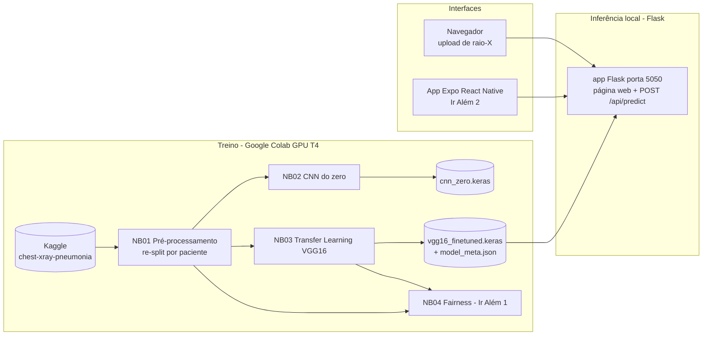
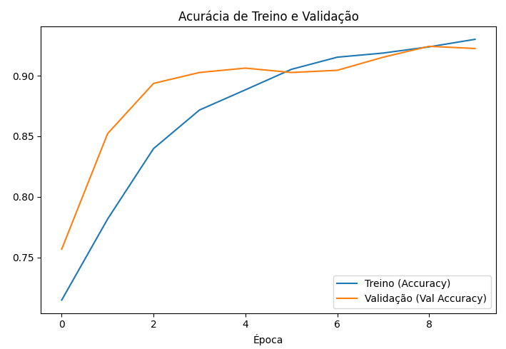
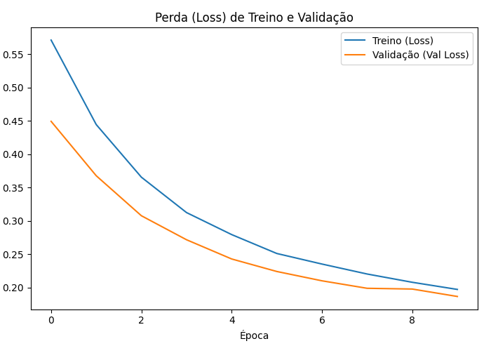
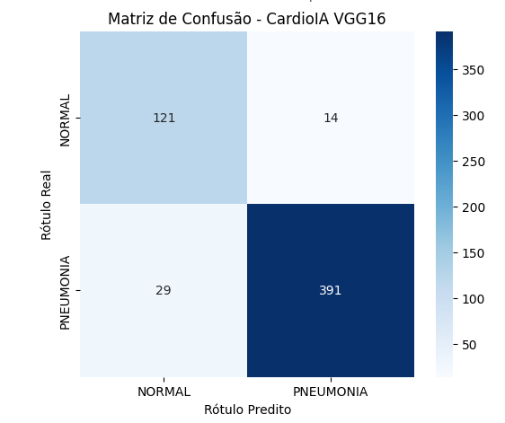
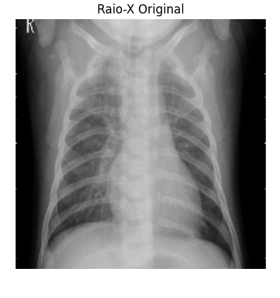
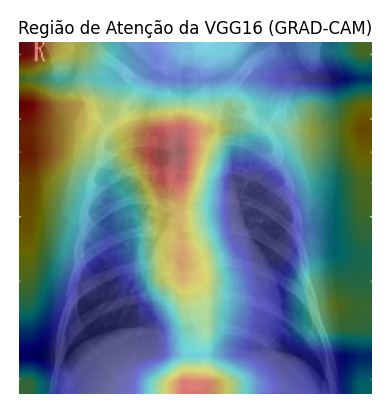
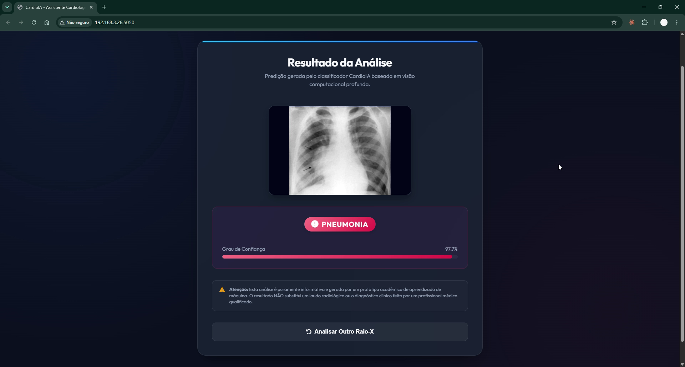
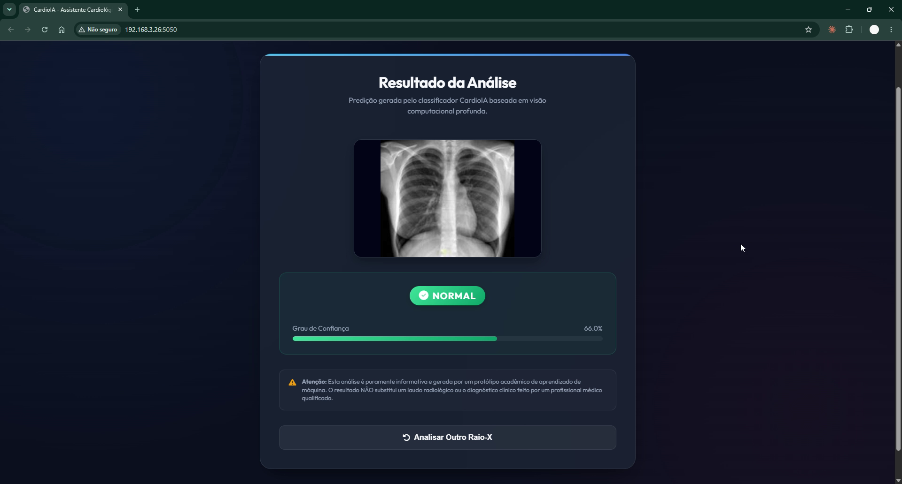
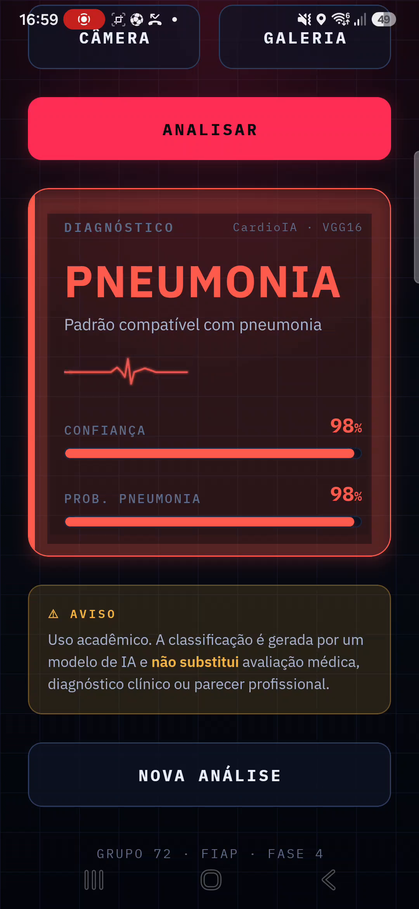
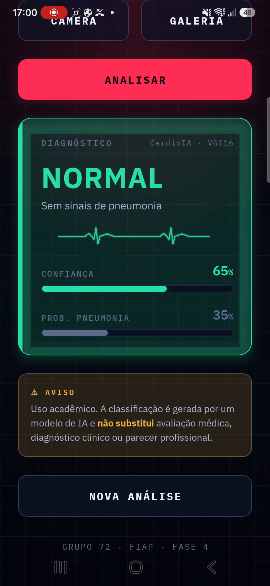

# Faculdade de Informática e Administração Paulista

<p align="center">
  
</p>

# CardioIA Visão Computacional - Assistente Cardiológico Virtual

**FIAP | Tecnólogo em Inteligência Artificial | Fase 4 | Capítulo 1**

## Grupo 72

| Integrante | GitHub |
|---|---|
| Felipe Sabino da Silva | [@FelipeSabinoTMRS](https://github.com/FelipeSabinoTMRS) |
| Juan Felipe Voltolini | [@juanvoltolini-rm562890](https://github.com/juanvoltolini-rm562890) |
| Luiz Henrique Ribeiro de Oliveira | [@Luiz-FIAP](https://github.com/Luiz-FIAP) |
| Marco Aurélio Eberhardt Assumpção | [@marcofiap](https://github.com/marcofiap) |
| Paulo Henrique Senise | [@PauloSenise](https://github.com/PauloSenise) |

## Descrição

Este repositório implementa a fase **CardioIA Visão Computacional**, continuidade do projeto da Fase 3. Na etapa anterior, a CardioIA estruturou o monitoramento contínuo de sinais vitais com IoT (ESP32, MQTT e dashboard Node-RED). Nesta fase, a solução avança para a análise de imagens médicas com **Deep Learning**: um protótipo que pré-processa radiografias de tórax, treina e compara uma **CNN do zero** com **Transfer Learning (VGG16)** e apresenta a classificação (NORMAL vs PNEUMONIA) em uma interface web Flask e em um app mobile.

O sistema cobre o fluxo completo de visão computacional aplicada à saúde:

```text
dataset público -> pré-processamento -> treino CNN / transfer learning -> avaliação -> protótipo web e mobile
```

### Arquitetura da solução



O dataset escolhido foi o **Chest X-Ray Pneumonia** (Kaggle `paultimothymooney/chest-xray-pneumonia`), com 5.856 radiografias de tórax pediátricas rotuladas como NORMAL ou PNEUMONIA (subtipos bactéria e vírus). A escolha é justificada no relatório da Parte 1.

Também foram implementados os desafios "Ir Além":

- **Ir Além 1**: análise de ética e fairness do dataset e do modelo (viés, desbalanceamento, subgrupos bactéria/vírus).
- **Ir Além 2**: app mobile em React Native (Expo) com upload de imagem, integrado ao backend Flask.

## Estrutura de pastas

```text
.
|-- assets/
|   |-- logo-fiap.png
|   `-- evidencias/            # prints das métricas, Grad-CAM e telas do app
|-- data/
|   |-- README.md
|   `-- splits/                # manifestos CSV do re-split (gerados pelo NB01)
|-- docs/                      # relatórios das Partes 1 e 2, Ir Além 1 e 2, roteiro do vídeo
|-- models/
|   `-- README.md              # como obter os modelos .keras (GitHub Release)
|-- notebooks/
|   |-- 01_preprocessamento.ipynb
|   |-- 02_cnn_do_zero.ipynb
|   |-- 03_transfer_learning.ipynb
|   `-- 04_fairness.ipynb
|-- scripts/
|   |-- download_model.py
|   `-- test_api.py
|-- src/
|   |-- flask-app/             # protótipo web + API REST
|   `-- mobile/                # app Expo React Native (Ir Além 2)
`-- README.md
```

A estrutura segue a divisão de trabalho descrita em `docs/plano_de_trabalho.md`.

## Como Executar o Projeto Localmente

Como os arquivos de pesos das redes neurais (`.keras` e `.h5`) são muito grandes para o histórico do Git, estruturamos um script automatizado que busca esses artefatos diretamente dos Releases do repositório.

### 1. Pré-requisitos e sincronização dos modelos
Antes de iniciar a API Flask ou os ambientes de teste, garanta que todas as dependências estejam instaladas e execute o script de sincronização para baixar os modelos de IA:

```bash
# Instalar as dependências do projeto
pip install -r requirements.txt

# Baixar os modelos treinados (VGG16 e CNN do zero) e metadados
python scripts/download_model.py
```

### 2. Executando o servidor (Flask)
Após o término do download, os arquivos estarão posicionados na pasta `models/`. Para iniciar o servidor de inferência:
`python src/flask-app/app.py`

## Desenvolvimento e Avaliação dos Modelos

### Treinamento da Rede VGG16 (Transfer Learning)

O modelo contido em `notebooks/03_transfer_learning.ipynb` utiliza a arquitetura consolidada **VGG16**, inicializada com pesos congelados da *ImageNet* para extração de características profundas, acoplada a uma nova camada densa especializada na classificação binária de imagens pulmonares (NORMAL vs PNEUMONIA).

O treinamento foi executado utilizando infraestrutura de aceleração por hardware (GPU T4) ao longo de 10 épocas, monitorado via funções de *Early Stopping* e *Model Checkpoint*.

### Métricas de Desempenho Alcançadas

O classificador atingiu estabilidade plena com convergência mútua e limpa entre as curvas de treino e validação de perda (*Loss*) e acurácia, eliminando problemas severos de *overfitting*.

* **Acurácia Geral do Modelo:** 92%

<p align="center">
  
  
</p>

```text
Relatório Técnico de Classificação:
              precision    recall  f1-score   support

      NORMAL       0.81      0.90      0.85       135
   PNEUMONIA       0.97      0.93      0.95       420

    accuracy                           0.92       555
   macro avg       0.89      0.91      0.90       555
weighted avg       0.93      0.92      0.92       555
```

A Matriz de Confusão do modelo revelou uma taxa de sensibilidade crítica (Recall de 93% para a classe PNEUMONIA), reduzindo drasticamente o índice de falsos negativos diagnósticos no conjunto de validação.

<p align="center">
  
</p>

### Camada de Explicabilidade Visual (GRAD-CAM)

Como critério de transparência e auditoria de interpretabilidade em IA na Saúde, aplicou-se a abordagem GRAD-CAM (Gradient-weighted Class Activation Mapping).

O mapeamento gerou representações térmicas visuais que atestam cientificamente que as ativações da última camada convolucional do modelo estão direcionando sua atenção de inferência precisamente para as áreas de consolidação/opacidade pulmonar características dos quadros infecciosos de pneumonia, em vez de se guiarem por vieses em bordas ou tecidos ósseos adjacentes.

<p align="center">
  
  
</p>

### Repositório do Arquivo de Pesos (.keras)

Devido ao tamanho do arquivo gerado, o artefato de pesos binários foi indexado e salvo de forma externa:

Link para Download do Modelo: [vgg16_finetuned.keras no Google Drive](https://drive.google.com/file/d/1cnCgAeOt1tJvHRd85B_rONsZQ5TFG6En/view?usp=sharing)

## Protótipo Web (Flask)

O backend Flask (`src/flask-app/`) também serve uma página web de classificação: o usuário faz upload de uma radiografia de tórax e recebe o resultado (classe + grau de confiança), consumindo o modelo **VGG16 real**. O mesmo servidor expõe o endpoint REST `POST /api/predict` usado pelo app mobile. Para executar, ver a seção "Como Executar o Projeto Localmente".

<p align="center">
  
  
</p>

## Aplicativo Mobile - Ir Além 2 (React Native / Expo)

O app em `src/mobile/` (Expo / React Native + TypeScript) leva a classificação para o celular: o usuário seleciona uma radiografia de tórax (câmera ou galeria) e recebe a categoria detectada pelo modelo (NORMAL ou PNEUMONIA) com a confiança, consumindo o **mesmo backend Flask** (`POST /api/predict`) pela rede Wi-Fi local. A interface tem identidade visual de "monitor cardíaco" (linha de ECG animada e medidores de confiança) e um aviso fixo de uso acadêmico.

A integração foi validada de ponta a ponta contra o modelo **VGG16 real** (via `curl` no endpoint que o app consome):

| Chamada | Resposta |
|---|---|
| `GET /api/health` | `model_loaded: true`, `mock_mode: false` |
| `POST /api/predict` (radiografia de pneumonia) | `PNEUMONIA` · confiança 0.9766 |
| `POST /api/predict` (radiografia normal) | `NORMAL` · prob. pneumonia 0.3405 |

**Como rodar (resumo):** suba o backend (`python scripts/download_model.py` e depois `python src/flask-app/app.py`), ajuste `src/mobile/.env` com o IP local da máquina (`EXPO_PUBLIC_USE_MOCK=false`, `EXPO_PUBLIC_API_URL=http://SEU_IP:5050`) e rode `npx expo start -c`, abrindo no Expo Go (celular na mesma Wi-Fi). Passo a passo completo em [`src/mobile/README.md`](src/mobile/README.md).

- Manual detalhado do app: [`src/mobile/README.md`](src/mobile/README.md)
- Relatório do Ir Além 2: [`docs/relatorio_ir_alem2_mobile.md`](docs/relatorio_ir_alem2_mobile.md)
- Roteiro do vídeo: [`docs/roteiro_video.md`](docs/roteiro_video.md)

<p align="center">
  
  
</p>

## Como executar (notebooks no Google Colab)

### Parte 1 - Pré-processamento

1. Abra `notebooks/01_preprocessamento.ipynb` no Google Colab (botão "Open in Colab" no próprio notebook ou upload manual).

2. Selecione um runtime com GPU (Runtime > Change runtime type > T4 GPU). A GPU não é obrigatória na Parte 1, mas mantém o ambiente idêntico ao dos notebooks de treino.

3. Execute `Runtime > Run all`. O notebook executará a análise exploratória, efetuará o re-split 90/10 por paciente e gerará os arquivos train.csv, val.csv e test.csv.

4. Copie os três CSVs baixados para `data/splits/` e faça commit. Os notebooks 02, 03 e 04 leem esses manifestos para garantir que todos usem exatamente o mesmo split.

### Parte 2 - Treinamento dos Modelos (CNN do zero e Transfer Learning VGG16)

1. Certifique-se de possuir os manifestos gerados na Parte 1 localizados na estrutura `data/splits/`.

2. Abra `notebooks/02_cnn_do_zero.ipynb` (CNN do zero) e `notebooks/03_transfer_learning.ipynb` (VGG16) no Google Colab.

3. Configure o ambiente de hardware com aceleração por GPU (Runtime > Change runtime type > T4 GPU).

4. Execute todas as células `Runtime > Run all`. Os notebooks efetuam a carga de dados equilibrada, o treino, a plotagem das curvas de erro/acurácia, a matriz de confusão e, no VGG16, a renderização final das imagens do teste anatômico pelo GRAD-CAM.

### Parte 3 - Status dos componentes

- CNN do Zero (`notebooks/02_cnn_do_zero.ipynb`): **concluída** - treinada e avaliada no conjunto de teste (curvas de treino, matriz de confusão e ROC em `assets/evidencias/`).

- Backend Flask (`src/flask-app/`): **concluído** - roda localmente na porta 5050, consome o modelo VGG16 treinado no Colab e oferece um painel web e o endpoint REST `/api/predict` integrado ao app mobile.

- Ir Além 1 (Fairness): **concluído** - notebook `notebooks/04_fairness.ipynb` e relatório `docs/relatorio_ir_alem1_fairness.md`.

- Ir Além 2 (Mobile): **concluído** - app Expo React Native em `src/mobile/`, integrado ao backend Flask (ver seção "Aplicativo Mobile" acima e `src/mobile/README.md`).

## Documentação adicional

- `docs/plano_de_trabalho.md` - plano completo da fase, com divisão de tarefas, dependências e riscos.
- `docs/relatorio_parte1_preprocessamento.md` - relatório da Parte 1 (dataset, re-split e pipeline).
- `docs/relatorio_parte2_cnn_transfer_learning.md` - relatório da Parte 2 (CNN do zero e Transfer Learning VGG16).
- `docs/relatorio_ir_alem1_fairness.md` - relatório do Ir Além 1 (ética e fairness).
- `docs/relatorio_ir_alem2_mobile.md` - relatório do Ir Além 2 (app mobile).
- `data/README.md` - como obter o dataset e o papel dos manifestos de split.
- `models/README.md` - como obter os modelos treinados.

## Links para entrega

- GitHub público: <https://github.com/juanvoltolini-rm562890/CardioIA-Fase4-Cap1>
- Notebooks no Colab: abrir os arquivos de `notebooks/` no Google Colab.
- Vídeo (YouTube, até 3 minutos): <https://youtu.be/MWg5o2Bh_Tg>

## Evidências

Prints salvos em `assets/evidencias/` (lista completa em `assets/evidencias/README.md`).

## Checklist do enunciado

- [x] Dataset público de imagens médicas selecionado (Chest X-Ray Pneumonia, Kaggle).
- [x] Pipeline de pré-processamento: redimensionamento, normalização e conversão de formatos.
- [x] Criação de conjuntos de treino, validação e teste (re-split por paciente).
- [x] Notebook Python (Google Colab) com o código de pré-processamento.
- [x] Relatório curto da Parte 1 com etapas e justificativas.
- [x] CNN simples treinada do zero com avaliação completa.
- [x] Transfer Learning funcional (VGG16) com comparativo.
- [x] Métricas: acurácia, matriz de confusão, precisão, recall, F1-score.
- [x] Prints das métricas de avaliação.
- [x] Protótipo de apresentação dos resultados (Flask web e app mobile).
- [x] Ir Além 1: relatório de ética e fairness (+ notebook).
- [x] Ir Além 2: app mobile React Native integrado ao backend + vídeo de até 3 minutos.
- [x] Documento mestre seguindo Template FIAP (entregue na plataforma FIAP).
- [x] Links de entrega preenchidos (GitHub e vídeo).

## Observação acadêmica

Este projeto é uma simulação acadêmica com dados públicos. O dataset é composto por radiografias pediátricas de uma única instituição, e as classificações geradas pelos modelos não substituem avaliação médica, validação clínica, certificação regulatória ou protocolos reais de diagnóstico.
