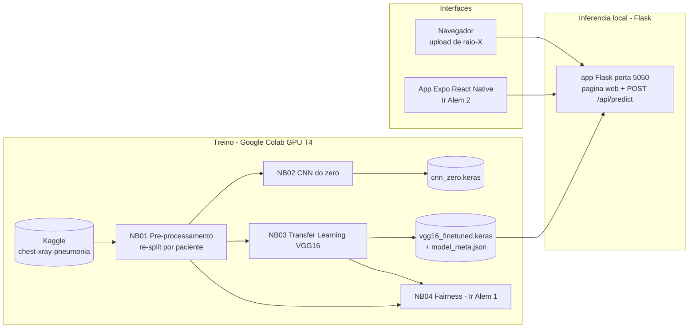

# Faculdade de Informatica e Administracao Paulista

<p align="center">
  
</p>

# CardioIA Visao Computacional - Assistente Cardiologico Virtual

**FIAP | Tecnologo em Inteligencia Artificial | Fase 4 | Capitulo 1**

## Grupo 59

| Integrante | GitHub |
|---|---|
| Felipe Sabino da Silva | [@FelipeSabinoTMRS](https://github.com/FelipeSabinoTMRS) |
| Juan Felipe Voltolini | [@juanvoltolini-rm562890](https://github.com/juanvoltolini-rm562890) |
| Luiz Henrique Ribeiro de Oliveira | [@Luiz-FIAP](https://github.com/Luiz-FIAP) |
| Marco Aurelio Eberhardt Assumpcao | [@marcofiap](https://github.com/marcofiap) |
| Paulo Henrique Senise | [@PauloSenise](https://github.com/PauloSenise) |

## Descricao

Este repositorio implementa a fase **CardioIA Visao Computacional**, continuidade do projeto da Fase 3. Na etapa anterior, a CardioIA estruturou o monitoramento continuo de sinais vitais com IoT (ESP32, MQTT e dashboard Node-RED). Nesta fase, a solucao avanca para a analise de imagens medicas com **Deep Learning**: um prototipo que pre-processa radiografias de torax, treina e compara uma **CNN do zero** com **Transfer Learning (VGG16)** e apresenta a classificacao (NORMAL vs PNEUMONIA) em uma interface web Flask e em um app mobile.

O sistema cobre o fluxo completo de visao computacional aplicada a saude:

```text
dataset publico -> pre-processamento -> treino CNN / transfer learning -> avaliacao -> prototipo web e mobile
```

### Arquitetura da solucao



O dataset escolhido foi o **Chest X-Ray Pneumonia** (Kaggle `paultimothymooney/chest-xray-pneumonia`), com 5.856 radiografias de torax pediatricas rotuladas como NORMAL ou PNEUMONIA (subtipos bacteria e virus). A escolha e justificada no relatorio da Parte 1.

Tambem serao implementados os desafios "Ir Alem":

- **Ir Alem 1**: analise de etica e fairness do dataset e do modelo (vies, desbalanceamento, subgrupos bacteria/virus).
- **Ir Alem 2**: app mobile em React Native (Expo) com upload de imagem, integrado ao backend Flask.

## Estrutura de pastas

```text
.
|-- assets/
|   |-- logo-fiap.png
|   `-- evidencias/
|       `-- README.md
|-- data/
|   |-- README.md
|   `-- splits/              # manifestos CSV do re-split (gerados pelo NB01)
|-- docs/
|   |-- plano_de_trabalho.md # divisao de tarefas entre os 5 integrantes
|   `-- relatorio_parte1_preprocessamento.md
|-- document/
|   `-- (documento mestre FIAP - Etapa 4)
|-- models/
|   `-- README.md            # como obter os modelos .keras (GitHub Release)
|-- notebooks/
|   `-- 01_preprocessamento.ipynb
|-- scripts/
|   `-- (download_model.py e test_api.sh - Etapas 2 e 3)
|-- src/
|   |-- flask-app/           # prototipo web + API REST (Etapa 2)
|   `-- mobile/              # app Expo React Native (Etapa 2)
`-- README.md
```

As pastas marcadas com "Etapa N" serao preenchidas conforme a divisao de trabalho em `docs/plano_de_trabalho.md`.

## Como executar

### Parte 1 - Pre-processamento (notebook no Google Colab)

1. Abra `notebooks/01_preprocessamento.ipynb` no Google Colab (botao "Open in Colab" no proprio notebook ou upload manual).
2. Selecione um runtime com GPU (`Runtime > Change runtime type > T4 GPU`). A GPU nao e obrigatoria na Parte 1, mas mantem o ambiente identico ao dos notebooks de treino.
3. Execute `Runtime > Run all`. O notebook:
   - baixa o dataset via `kagglehub` (sem necessidade de credenciais);
   - inventaria os splits originais e evidencia o problema do conjunto de validacao com 16 imagens;
   - faz a analise exploratoria (amostras, dimensoes, distribuicao de classes e subtipos);
   - executa o re-split 90/10 por paciente com verificacoes automaticas de vazamento;
   - gera `train.csv`, `val.csv` e `test.csv` e oferece o download dos arquivos;
   - demonstra o pipeline de pre-processamento (resize 224x224, conversao RGB, normalizacoes e augmentation).
4. Copie os tres CSVs baixados para `data/splits/` e faca commit. Os notebooks 02, 03 e 04 leem esses manifestos para garantir que todos usem exatamente o mesmo split.

### Parte 2 - CNN, Transfer Learning e prototipo Flask

Em desenvolvimento (Etapas 2 e 3 do plano). Os notebooks `02_cnn_do_zero.ipynb` e `03_transfer_learning.ipynb` seguem o mesmo fluxo do NB01 no Colab; o prototipo Flask rodara localmente na porta 5050 com o modelo publicado em GitHub Release. Instrucoes detalhadas em `docs/plano_de_trabalho.md`.

### Ir Alem 1 e 2

Em desenvolvimento (Etapas 2 e 3 do plano): notebook de fairness (`04_fairness.ipynb`) e app mobile Expo (`src/mobile/`).

## Documentacao adicional

- `docs/plano_de_trabalho.md` - plano completo da fase, com divisao de tarefas, dependencias e riscos.
- `docs/relatorio_parte1_preprocessamento.md` - relatorio da Parte 1 (dataset, re-split e pipeline).
- `data/README.md` - como obter o dataset e o papel dos manifestos de split.
- `models/README.md` - como obter os modelos treinados.

## Links para entrega

- GitHub publico: `[PREENCHER apos publicacao]`
- Notebooks no Colab: abrir os arquivos de `notebooks/` no Google Colab.
- Link video YouTube nao listado (ate 3 minutos): `[PREENCHER na Etapa 4]`

## Evidencias para anexar antes da entrega final

Salvar os prints em `assets/evidencias/` (lista completa em `assets/evidencias/README.md`).

## Checklist do enunciado

- [x] Dataset publico de imagens medicas selecionado (Chest X-Ray Pneumonia, Kaggle).
- [x] Pipeline de pre-processamento: redimensionamento, normalizacao e conversao de formatos.
- [x] Criacao de conjuntos de treino, validacao e teste (re-split por paciente).
- [x] Notebook Python (Google Colab) com o codigo de pre-processamento.
- [x] Relatorio curto da Parte 1 com etapas e justificativas.
- [ ] CNN simples treinada do zero com avaliacao completa.
- [ ] Transfer Learning funcional (VGG16) com comparativo.
- [ ] Metricas: acuracia, matriz de confusao, precisao, recall, F1-score.
- [ ] Prints das metricas de avaliacao.
- [ ] Prototipo de apresentacao dos resultados (Flask web).
- [ ] Ir Alem 1: relatorio de etica e fairness (+ notebook).
- [ ] Ir Alem 2: app mobile React Native integrado ao backend + video de ate 3 minutos.
- [ ] Documento mestre seguindo Template FIAP (`document/`).
- [ ] Links de entrega preenchidos (GitHub e video).

## Observacao academica

Este projeto e uma simulacao academica com dados publicos. O dataset e composto por radiografias pediatricas de uma unica instituicao, e as classificacoes geradas pelos modelos nao substituem avaliacao medica, validacao clinica, certificacao regulatoria ou protocolos reais de diagnostico.
